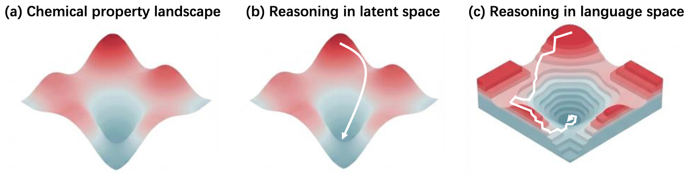

<div align="center">

<h1>LatentChem</h1>

<h3>From Textual CoT to Latent Thinking in Chemical Reasoning</h3>

</div>

This is the official repository for our paper "LatentChem: From Textual CoT to Latent Thinking in Chemical Reasoning." Through our study, we found that continuous latent thinking is a superior substrate for chemical reasoning over explicit CoT, overcoming the modality mismatch between language and chemical logic.

<div align="center">
  
</div>

---

## 🛠 Installation

### 1. Clone the Repository
```bash
git clone https://github.com/xinwuye/LatentChem.git
cd LatentChem
chmod +x scripts/training/*.sh scripts/data/*.sh scripts/eval/*.bash
```

### 2. Environment Setup
We use Conda for environment management. Follow these steps precisely to ensure all dependencies are correctly installed.

```bash
# Create and activate the environment
conda env create -f env.yml
conda activate latentchem_dev

# Install core dependencies
pip install trl==0.26.2 pytorch-fast-transformers==0.4.0 rdkit peft==0.17.1 plotext wandb liger-kernel vllm==0.11.2

# Reinstall pytorch-fast-transformers to ensure compatibility
pip uninstall -y pytorch-fast-transformers 
pip install --no-cache-dir pytorch-fast-transformers==0.4.0

# Optional: Install PyTDC for small molecule GRPO training
# Note: You may see compatibility errors during these steps; they can be safely ignored.
pip install PyTDC
pip install transformers==4.57.3 accelerate==1.10.1
```

---

## 📂 Data & Model Preparation

### 1. Training Data
Download and extract the training datasets using our helper script:
```bash
bash scripts/data/prepare_train_data.sh
```

### 2. Base Models
Download the required pretrained models (Qwen3-8B-Base and smi-ted):
```bash
bash scripts/data/download_models.sh
```

### 3. Test Data
Download the evaluation benchmarks:
```bash
bash scripts/data/prepare_test_data.sh
```

---

## 🏋️ Training Pipeline

The training process is divided into four stages. We provide scripts for each stage in the `scripts/training/` directory.

### Stage 1: Establishing the molecular-linguistic mapping
```bash
bash scripts/training/train_stage1.sh
```

### Stage 2: SFT for molecule-aware CoT
```bash
bash scripts/training/train_stage2.sh
```

### Stage 3: Chemistry-aware latent mind activation
```bash
bash scripts/training/train_stage3.sh
```

### Stage 4: GRPO with latent thinking budget
```bash
# Note: If sklearn throws ValueError: node array from the pickle has an incompatible dtype, you can run the following command to fix oracle compatibility.
cd code_train_sft/reward_utils
python ../../utils/prefetch_tdc_oracles.py --force --verify

bash scripts/training/train_stage4_grpo.sh
```

---

## 🧪 Inference & Evaluation

### 1. Checkpoint Preparation
You can download our pretrained LatentChem checkpoints:
```bash
huggingface-cli download anonymousssss22321/latentchem --local-dir ./checkpoints
```

Ensure your checkpoint directory follows this structure:
```text
ckpt_dir
├── added_tokens.json
├── chat_template.jinja
├── lora_weights/
│   ├── adapter_config.json
│   └── adapter_model.safetensors
├── mm_projector.pt
├── tokenizer.json
└── ...
```

### 2. Running Evaluation
We provide a comprehensive inference-evaluation pipeline. You can customize `CUDA_DEVICES`, `BATCH_SIZE`, and `DATASET_NAME` within the script.

```bash
# Note: If sklearn throws ValueError: node array from the pickle has an incompatible dtype, you can run the following command to fix oracle compatibility.
cd eval
python ../utils/prefetch_tdc_oracles.py --force --verify

# Example: Running evaluation on the provided checkpoint
bash scripts/eval/eval_stage3.bash \
    --exp_name <your_exp_name> \
    --ckpt-dir ./checkpoints \
    --is_both_latent false \
    --is_task_thinker true \
    --is_bio_updater true \
    --temperature 1.5
```

### 3. Results Analysis
- **Raw Outputs:** `outputs/<exp_name>`
- **Logs:** `eval/logs`
- **Evaluation Metrics:** `eval/results`

To reproduce win-rate statistics, run the evaluation command with `--mode record` and use the provided analysis script:
```bash
python eval/results/querywise/eval_querywise.py
```

---

## 📄 License
This project is licensed under the MIT License. See the [LICENSE](LICENSE) file for details.
